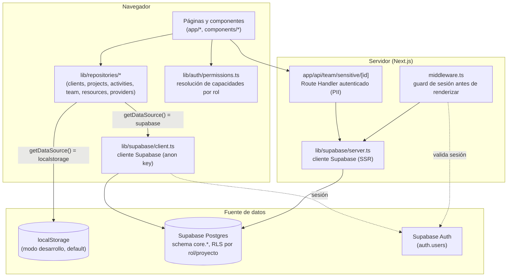
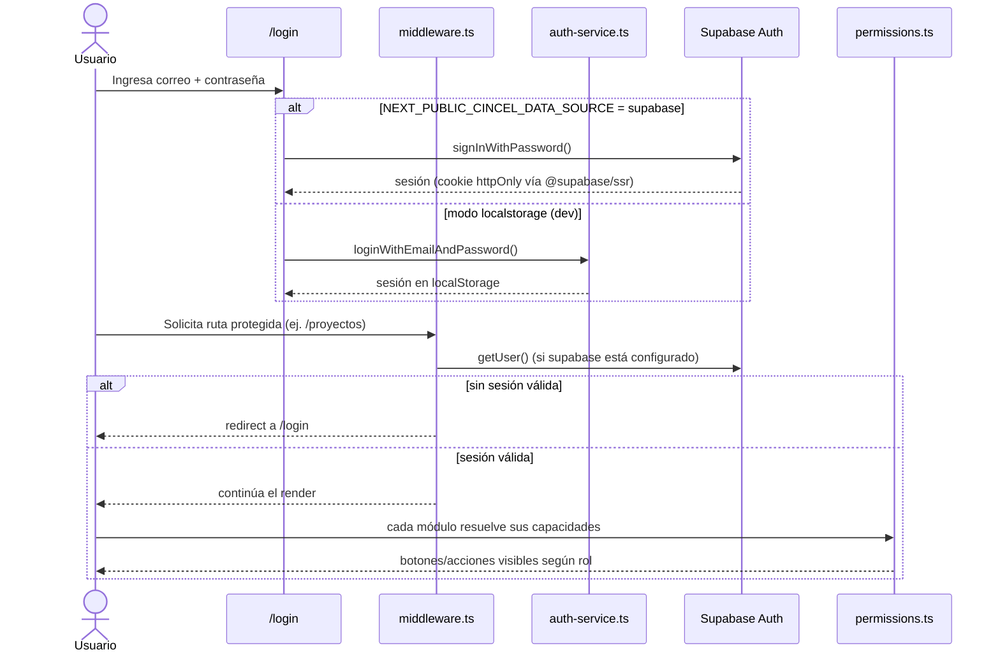
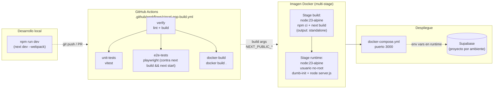
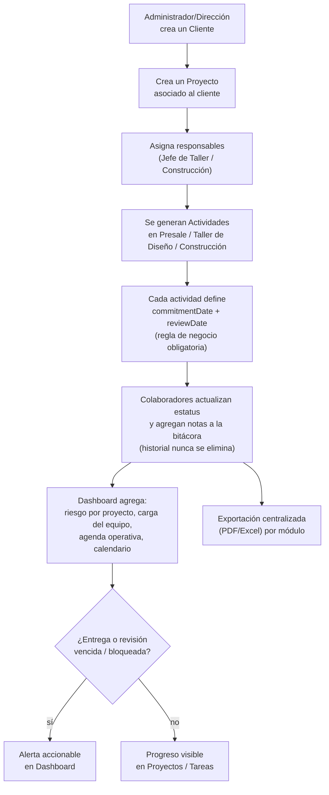

# Cincel Workspace

ERP interno para un despacho de arquitectura y construcción: gestión centralizada de proyectos, tareas, clientes, equipo, proveedores y recursos, con permisos configurables por rol.

Construido con **Next.js 16 (App Router) + React 19 + TypeScript + Tailwind CSS 4**, persistencia opcional en **Supabase (Postgres + Auth + RLS)** con un modo `localStorage` autocontenido para desarrollo sin infraestructura externa.

> Convenciones de código, filosofía de producto y reglas de negocio: ver [`AGENTS.md`](./AGENTS.md).

---

## Tabla de contenidos

- [Arquitectura](#arquitectura)
- [Modelo de autenticación y autorización](#modelo-de-autenticación-y-autorización)
- [Infraestructura y despliegue](#infraestructura-y-despliegue)
- [Flujo de uso (caso de uso principal)](#flujo-de-uso-caso-de-uso-principal)
- [Matriz de funcionalidades por módulo](#matriz-de-funcionalidades-por-módulo)
- [Roles del sistema](#roles-del-sistema)
- [Guía para desarrolladores](#guía-para-desarrolladores)
- [Testing](#testing)
- [Estructura del proyecto](#estructura-del-proyecto)

---

## Arquitectura

La app es un monolito Next.js: todas las rutas viven bajo `app/`, la UI es enteramente cliente (`"use client"`) para las pantallas de datos, y la capa de persistencia se resuelve en tiempo de ejecución según `NEXT_PUBLIC_CINCEL_DATA_SOURCE`.



**Puntos clave:**

- **`lib/supabase/data-source.ts`** decide en runtime si la app corre en `localstorage` (mock/dev, sin dependencias externas) o `supabase` (persistencia real, RLS aplicado). El valor por defecto es `localstorage`; ver [`docs/deployment.md`](./docs/deployment.md) para el valor esperado por ambiente.
- Cada repositorio en `lib/repositories/` implementa **ambos** caminos con la misma interfaz, así los componentes de UI no conocen la fuente de datos.
- Los datos sensibles (PII de colaboradores: CURP, RFC, domicilio) **no** viven en el bundle de cliente — se separan en `lib/data/team.ts` (servidor) vs. `lib/data/team-public.ts` (cliente), y se sirven solo vía `app/api/team/sensitive/[id]/route.ts`, autenticado.
- Las políticas RLS en Postgres (`supabase/migrations/202608250001_rls_scoped_policies.sql`) son la última línea de defensa: incluso si la UI oculta un botón, una escritura directa contra la misma anon key es rechazada si el rol/proyecto no lo permite.

## Modelo de autenticación y autorización



- **`middleware.ts`** protege rutas a nivel de servidor, antes de que se descargue cualquier bundle — no depende de JavaScript del cliente. Es un no-op transparente cuando no hay credenciales de Supabase configuradas (modo `localstorage`).
- **`components/auth/AppRouteGuard.tsx`** es una capa adicional de UX (evita parpadeo de contenido durante hidratación), no la barrera de seguridad principal.
- **`lib/auth/permissions.ts`** centraliza "qué puede hacer cada rol" por módulo (Dashboard, Calendario, Actividades, Proyectos, Recursos, Clientes, Equipo), con overrides configurables por un administrador desde `Configuración → Permisos` — no es una matriz fija en código, sino un conjunto de defaults por rol que puede sobreescribirse en runtime.

## Infraestructura y despliegue



- **`Dockerfile`**: build multi-stage sobre `node:23-alpine`. Las variables `NEXT_PUBLIC_*` de Supabase se pasan como **build args** (Next.js las incrusta en el bundle en build time, no en runtime), documentado en [`.env.example`](./.env.example).
- **`docker-compose.yml`**: no incluye un servicio de base de datos local — Supabase es un servicio externo administrado (o el modo `localstorage` no requiere base de datos alguna).
- **CI** (`cincel-app-build.yml`) corre en cada PR/push a `main` que toque `cincel-app/**`: lint + build, suite unitaria (vitest), suite E2E (Playwright, contra una build de producción — no `next dev`, por estabilidad), y una verificación de que la imagen Docker construye.
- No hay paso de *push* a un registro de contenedores todavía — la validación de CI es solo de build.

## Flujo de uso (caso de uso principal)

Ciclo de vida típico de un proyecto, de punta a punta:



## Matriz de funcionalidades por módulo

| Módulo | Ruta | Descripción | Persistencia | Componentes/lib clave |
|---|---|---|---|---|
| **Dashboard** | `/dashboard` | Riesgo por proyecto, carga del equipo, agenda operativa, calendario resumido, alertas accionables | Deriva de Proyectos + Actividades | `components/dashboard/InteractiveDashboard.tsx` |
| **Calendario** | `/calendario` | Vista unificada de eventos (compromisos, revisiones, entregas) por día/equipo | Deriva de Actividades | `components/calendario/UnifiedCalendar.tsx`, `lib/calendar/calendar-service.ts` |
| **Actividades (Tareas)** | `/tareas`, `/tareas/presale`, `/tareas/diseno`, `/tareas/construccion` | Gestión de tareas por flujo de trabajo (Presale, Taller de Diseño, Construcción), con `commitmentDate`/`reviewDate` obligatorios e historial append-only | `localStorage` o Supabase (`core.activities`) | `components/tareas/PresaleTable.tsx`, `lib/repositories/activities-repository.ts` |
| **Proyectos** | `/proyectos`, `/proyectos/[id]` | Tabla de proyectos con filtros, edición inline, notas, ficha de detalle, autoguardado con debounce/diff | `localStorage` o Supabase (`core.projects`) | `components/proyectos/ProjectsTable.tsx`, `lib/repositories/projects-repository.ts` |
| **Clientes** | `/clientes`, `/clientes/[id]` | CRUD de clientes, historial de interacciones, ficha de detalle | `localStorage` o Supabase (`core.clients`) | `lib/repositories/clients-repository.ts`, `lib/repositories/client-history-repository.ts` |
| **Equipo** | `/equipo` | Alta/edición de colaboradores, roles del sistema, disponibilidad y carga de trabajo | `localStorage`/Supabase (público) + API autenticada para PII | `app/equipo/page.tsx`, `app/api/team/sensitive/[id]/route.ts`, `lib/repositories/team-repository.ts` |
| **Proveedores** | `/proveedores/contratistas`, `/proveedores/colaboradores`, `/proveedores/tiendas` | Catálogo de contratistas, colaboradores externos y tiendas | Supabase (`core.contractors`, `core.collaborator_providers`, `core.stores`) | `lib/repositories/providers-repository.ts` |
| **Recursos** | `/recursos/*` | Documentos, favoritos, plantillas de diseño, formatos de obra, vacaciones, formación, y sección Empresa (book, manual, imagen, RFC, políticas) | `localStorage` o Supabase (`core.resource_links`) | `components/recursos/ResourcesWorkspace.tsx`, `lib/repositories/resources-repository.ts` |
| **Configuración** | `/configuracion/general`, `/configuracion/permisos` | Ajustes generales del sistema (nombre, versión, logo) y overrides de permisos por rol/módulo | `localStorage` | `components/configuracion/GeneralSettingsWorkspace.tsx`, `components/configuracion/PermissionsWorkspace.tsx` |
| **Exportación** | (transversal, botón "Exportar" por módulo) | Exportación a PDF/Excel con checklist de QA | En memoria (no persiste) | `components/ui/ExportMenu.tsx`, `lib/utils/export-service.ts` |
| **Autenticación** | `/login`, `/change-password`, `/profile` | Login (localStorage hash o Supabase Auth real), cambio de contraseña, perfil con foto por colaborador | Supabase Auth o `localStorage` | `lib/auth/auth-service.ts`, `lib/auth/supabase-auth.ts`, `middleware.ts` |

## Roles del sistema

Definidos en `lib/data/roles.ts` (`OFFICIAL_CINCEL_ROLES`). El acceso por módulo es configurable por un Administrador en `Configuración → Permisos`; esta tabla resume el nivel de acceso **por defecto**:

| Rol | Alcance de datos por defecto | Notas |
|---|---|---|
| **Administrador** | Global | Acceso total; escalación automática vía `CINCEL_ADMIN_EMAILS` (variable de entorno) |
| **Dirección** | Global | Visibilidad ejecutiva de todos los proyectos |
| **Jefe de Taller** | Proyectos/tareas gestionadas | Lidera el flujo de Taller de Diseño |
| **Jefe de Construcción** | Proyectos/tareas gestionadas | Lidera el flujo de Construcción |
| **Arquitecto Senior** | Proyectos/tareas asignadas | |
| **Arquitecto Junior** | Tareas asignadas | |
| **Colaborador** | Tareas asignadas | Rol por defecto para nuevas altas |
| **Pasante / Servicio Social** | Tareas asignadas (acotado) | |
| **Otros** | Mínimo | Rol de contención para casos no clasificados |

## Guía para desarrolladores

### Requisitos

- Node.js 23+
- Docker + Docker Compose (opcional, para correr la imagen productiva localmente)
- Un proyecto Supabase (opcional — solo si vas a probar el modo `supabase`; el modo `localstorage` no requiere nada externo)

### Arranque rápido (modo localstorage, sin dependencias externas)

```bash
npm install
npm run dev
# http://localhost:3000
```

Sin variables de entorno configuradas, la app corre enteramente sobre `localStorage` con datos mock (`lib/data/*`) — ideal para desarrollo de UI sin tocar infraestructura.

### Variables de entorno

Ver [`.env.example`](./.env.example) para el detalle completo. Las relevantes para desarrollo:

| Variable | Uso | Default |
|---|---|---|
| `NEXT_PUBLIC_CINCEL_DATA_SOURCE` | `localstorage` o `supabase` | `localstorage` |
| `NEXT_PUBLIC_SUPABASE_URL` | URL del proyecto Supabase | — |
| `NEXT_PUBLIC_SUPABASE_ANON_KEY` / `NEXT_PUBLIC_SUPABASE_PUBLISHABLE_KEY` | Llave pública (anon) de Supabase | — |
| `CINCEL_ADMIN_EMAILS` | Emails con escalación automática a Administrador (solo servidor) | vacío |

> Las variables `NEXT_PUBLIC_*` se incrustan en el bundle en **build time**. Para Docker, se pasan como build args (ver `docker-compose.yml`), no solo como variables de runtime.

### Scripts disponibles

```bash
npm run dev              # servidor de desarrollo (next dev --webpack)
npm run build             # build de producción (output: standalone)
npm run start             # sirve el build de producción
npm run lint               # eslint
npm run test:unit         # vitest (lib/auth/permissions.ts, auth-service.ts, reglas de negocio de tareas)
npm run test:unit:watch   # vitest en modo watch
npm run test:e2e          # playwright (levanta el server automáticamente)
npm run test:e2e:ui       # playwright con UI interactiva
npm run health:check                # smoke test de la fuente de datos configurada
npm run health:check:authenticated  # smoke test autenticado contra Supabase
npm run e2e:clientes             # script E2E legado: CRUD de clientes
npm run e2e:modules-smoke        # script E2E legado: smoke test de todos los módulos
```

### Correr con Docker

```bash
docker compose build
docker compose up
# http://localhost:3000
```

Ver [`Dockerfile`](./Dockerfile) y [`docker-compose.yml`](./docker-compose.yml). Sin build args de Supabase, la imagen sirve la app en modo `localstorage`.

### Base de datos (modo Supabase)

Las migraciones viven en `supabase/migrations/`, en orden numérico. Incluyen: tablas core, índices, políticas RLS con scoping real por rol/proyecto (`202608250001_rls_scoped_policies.sql`), y CHECK constraints de integridad de fechas (`202608250002_activities_date_constraints.sql`). Ver [`supabase/README.md`](./supabase/README.md) y [`docs/deployment.md`](./docs/deployment.md) para el procedimiento por ambiente.

## Testing

| Tipo | Herramienta | Ubicación | Qué cubre |
|---|---|---|---|
| Unitario | Vitest + happy-dom | `tests/unit/` | Matriz de permisos por rol, flujo de login/hash, reglas de negocio de Tareas (fechas obligatorias, historial append-only), autorización a nivel de repositorio |
| E2E | Playwright | `tests/e2e/` | Login (flujo real de formulario), navegación, CRUD de Proyectos/Tareas/Equipo, exportación |
| Smoke scripts | Node (`.mjs`) | `scripts/` | Verificación rápida de la fuente de datos configurada, con y sin autenticación |

La suite E2E corre en CI contra una build de producción (`next build && next start`), no `next dev`, para evitar timeouts por compilación bajo demanda en runners compartidos.

## Estructura del proyecto

```
app/                  Rutas y páginas (App Router)
  api/                Route Handlers autenticados (ej. PII de equipo)
components/
  layout/             Header, Sidebar, estructura general
  dashboard/          Panel principal
  proyectos/          Tabla y ficha de proyectos
  tareas/             Flujos de actividades (Presale/Diseño/Construcción)
  calendario/         Calendario unificado
  configuracion/      Ajustes generales y permisos
  auth/               Guards de ruta client-side
  ui/                 Componentes reutilizables (Avatar, ExportMenu, ...)
lib/
  auth/               Login, sesión, permisos por rol
  data/               Datos mock y catálogos (equipo, roles, proyectos base)
  repositories/       Capa de datos: localStorage ↔ Supabase por módulo
  supabase/           Clientes Supabase (browser/server), fuente de datos activa
  settings/           Configuración general persistida
  calendar/           Agregación de eventos de calendario
  templates/          Plantillas de fases/tareas por flujo
  types/              Tipos de dominio compartidos
  utils/              Exportación, fechas, vinculación de tareas
middleware.ts         Guard de sesión a nivel de servidor
supabase/             Migraciones SQL, tests RLS, config local de Supabase
tests/                Suites unitarias y E2E
scripts/              Health checks y scripts E2E legados
docs/                 Documentación de arquitectura, seguridad, fases y sprints
```
