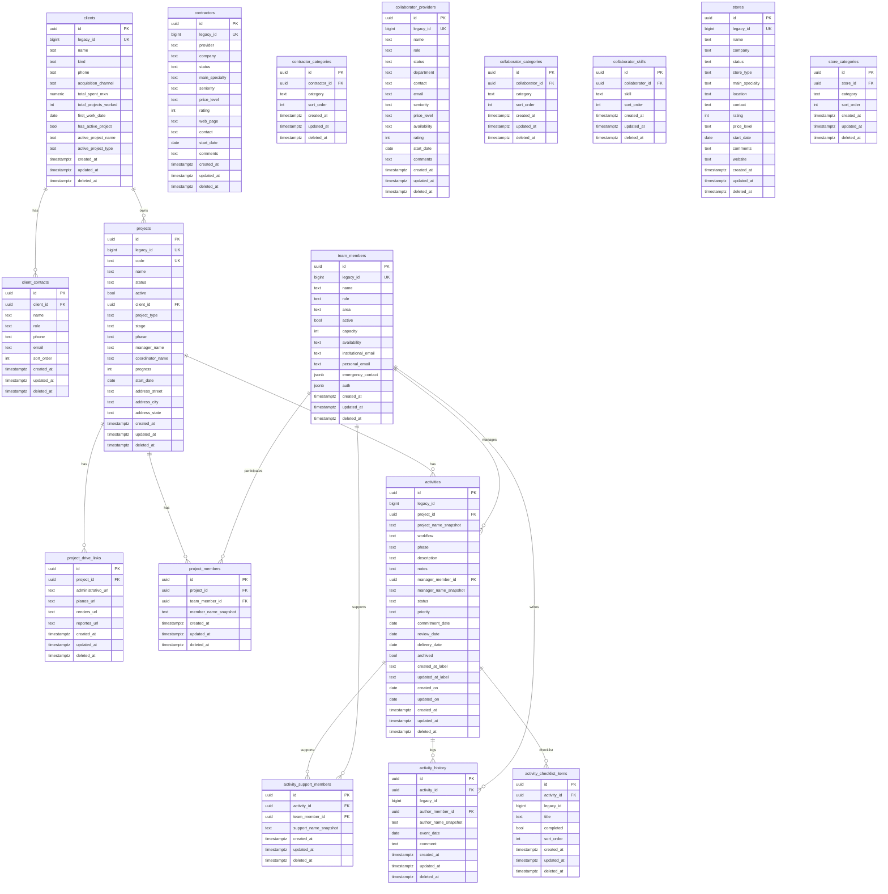

# ERD Sprint 11.1

```mermaid
erDiagram
  clients ||--o{ client_contacts : has
  clients ||--o{ projects : owns

  projects ||--o{ project_drive_links : has
  projects ||--o{ project_members : has
  projects ||--o{ activities : has

  team_members ||--o{ project_members : participates
  team_members ||--o{ activities : manages

  activities ||--o{ activity_support_members : supports
  team_members ||--o{ activity_support_members : supports

  activities ||--o{ activity_history : logs
  team_members ||--o{ activity_history : writes

  activities ||--o{ activity_checklist_items : checklist

  clients {
    uuid id PK
    bigint legacy_id UK
    text name
    text kind
    text phone
    text acquisition_channel
    numeric total_spent_mxn
    int total_projects_worked
    date first_work_date
    bool has_active_project
    text active_project_name
    text active_project_type
    timestamptz created_at
    timestamptz updated_at
    timestamptz deleted_at
  }

  client_contacts {
    uuid id PK
    uuid client_id FK
    text name
    text role
    text phone
    text email
    int sort_order
    timestamptz created_at
    timestamptz updated_at
    timestamptz deleted_at
  }

  team_members {
    uuid id PK
    bigint legacy_id UK
    text name
    text role
    text area
    bool active
    int capacity
    text availability
    text institutional_email
    text personal_email
    jsonb emergency_contact
    jsonb auth
    timestamptz created_at
    timestamptz updated_at
    timestamptz deleted_at
  }

  projects {
    uuid id PK
    bigint legacy_id UK
    text code UK
    text name
    text status
    bool active
    uuid client_id FK
    text project_type
    text stage
    text phase
    text manager_name
    text coordinator_name
    int progress
    date start_date
    text address_street
    text address_city
    text address_state
    timestamptz created_at
    timestamptz updated_at
    timestamptz deleted_at
  }

  project_drive_links {
    uuid id PK
    uuid project_id FK
    text administrativo_url
    text planos_url
    text renders_url
    text reportes_url
    timestamptz created_at
    timestamptz updated_at
    timestamptz deleted_at
  }

  project_members {
    uuid id PK
    uuid project_id FK
    uuid team_member_id FK
    text member_name_snapshot
    timestamptz created_at
    timestamptz updated_at
    timestamptz deleted_at
  }

  activities {
    uuid id PK
    bigint legacy_id
    uuid project_id FK
    text project_name_snapshot
    text workflow
    text phase
    text description
    text notes
    uuid manager_member_id FK
    text manager_name_snapshot
    text status
    text priority
    date commitment_date
    date review_date
    date delivery_date
    bool archived
    text created_at_label
    text updated_at_label
    date created_on
    date updated_on
    timestamptz created_at
    timestamptz updated_at
    timestamptz deleted_at
  }

  activity_support_members {
    uuid id PK
    uuid activity_id FK
    uuid team_member_id FK
    text support_name_snapshot
    timestamptz created_at
    timestamptz updated_at
    timestamptz deleted_at
  }

  activity_history {
    uuid id PK
    uuid activity_id FK
    bigint legacy_id
    uuid author_member_id FK
    text author_name_snapshot
    date event_date
    text comment
    timestamptz created_at
    timestamptz updated_at
    timestamptz deleted_at
  }

  activity_checklist_items {
    uuid id PK
    uuid activity_id FK
    bigint legacy_id
    text title
    bool completed
    int sort_order
    timestamptz created_at
    timestamptz updated_at
    timestamptz deleted_at
  }

  contractors {
    uuid id PK
    bigint legacy_id UK
    text provider
    text company
    text status
    text main_specialty
    text seniority
    text price_level
    int rating
    text web_page
    text contact
    date start_date
    text comments
    timestamptz created_at
    timestamptz updated_at
    timestamptz deleted_at
  }

  contractor_categories {
    uuid id PK
    uuid contractor_id FK
    text category
    int sort_order
    timestamptz created_at
    timestamptz updated_at
    timestamptz deleted_at
  }

  collaborator_providers {
    uuid id PK
    bigint legacy_id UK
    text name
    text role
    text status
    text department
    text contact
    text email
    text seniority
    text price_level
    text availability
    int rating
    date start_date
    text comments
    timestamptz created_at
    timestamptz updated_at
    timestamptz deleted_at
  }

  collaborator_categories {
    uuid id PK
    uuid collaborator_id FK
    text category
    int sort_order
    timestamptz created_at
    timestamptz updated_at
    timestamptz deleted_at
  }

  collaborator_skills {
    uuid id PK
    uuid collaborator_id FK
    text skill
    int sort_order
    timestamptz created_at
    timestamptz updated_at
    timestamptz deleted_at
  }

  stores {
    uuid id PK
    bigint legacy_id UK
    text name
    text company
    text status
    text store_type
    text main_specialty
    text location
    text contact
    int rating
    text price_level
    date start_date
    text comments
    text website
    timestamptz created_at
    timestamptz updated_at
    timestamptz deleted_at
  }

  store_categories {
    uuid id PK
    uuid store_id FK
    text category
    int sort_order
    timestamptz created_at
    timestamptz updated_at
    timestamptz deleted_at
  }
```
